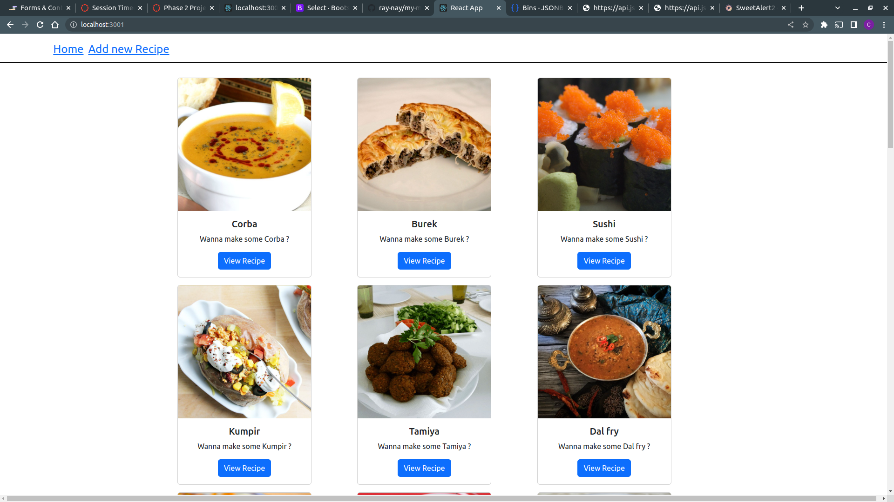
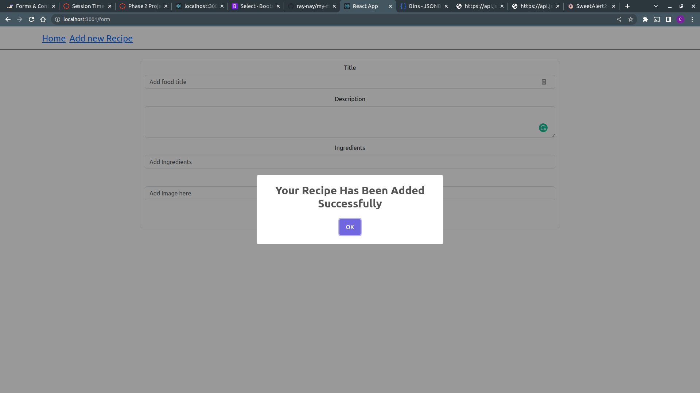
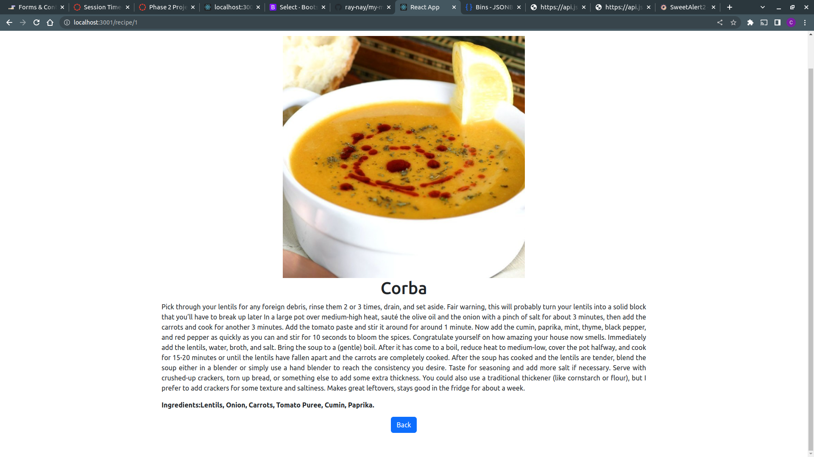

# Name of the Project
My meal recipe app.
### Author : Name Date
Catherine Renee Mumbi 29/01/2023
## Project Description
This project is a single page application that displays to the user a list of all the available meals whose recipe they can find on the website. The project incorporates a form that enables the user to add the recipe for their meal of preference. It also enables the user to click on the View Recipe button in order to get more details on the meal such as the recipe and ingredients.

## Project SetUp 
1. Clone the repository

https://github.com/ray-nay/my-meal-recipe-app

2. Install dependencies

npm install
3. Start the development server

npm start

4. Open your browser and navigate to http://localhost:3001 to view the app.
******

## Technologies Used
1.ReactJS
2.React Router
3.Babel
4.ESlint
5.Node.js
6.Vercel
7.Sweet alert
*****

### Landing page 
This is the landing page.

### Form page that is used to submit a new recipe.
This is the page that holds the form used to submit a new meal recipe.

### Recipe display page
This is the page that displays the full recipe as well as ingredients after the user has clicked on the View Recipe.

## LIve site
[Live link]()

## Contact Information
* 1723renee@gmail.com
*****